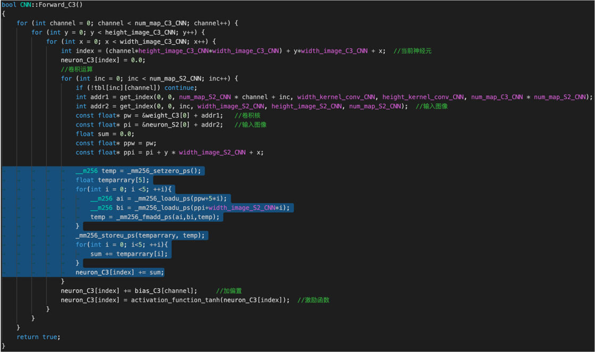

<!--
 * @Author: your name
 * @Date: 2021-03-11 21:07:51
 * @LastEditTime: 2021-03-11 21:38:50
 * @LastEditors: Please set LastEditors
 * @Description: In User Settings 
 * @FilePath: /异构计算大作业李圣韬1901213315/readme.md
-->
# LeNet-5 卷积神经网络计算优化


## 使用的优化方法
* Unrollinig
* SIMD
* OpenMP
* OpenCL

## 环境
* OS        macOS Mojave 10.14.6
* CPU       2.7GHz Intel Core i7
* GPU       Intel Iris Plus GraPhics 655 1536MB
* Complier  g++, clang++
* OpenCL    OpenCL 1.2

## 计算热点分析


## Unrolling
对内层循环进行展开，扩大基本块大小，增加寄存器重命名机会


## SIMD
批量处理数据，提高数据并行度


## openMP
利用CPU多核将数据无关的循环分配到多线程同时执行
OpenMP对macOS平台支持不完善，环境配置，编译困难
解决：
```clang++ -Xpreprocessor -fopenmp -O3 *.cpp -o ../Release/openmp_cnn -lomp```


## openCL
Forward:按照每个输出像素分配一个线程展开

与forward顺序相反
output层：按照num_neuron_output_CNN循环展开

分为两个kernel函数，分别计算weight和bias


## 优化对比

